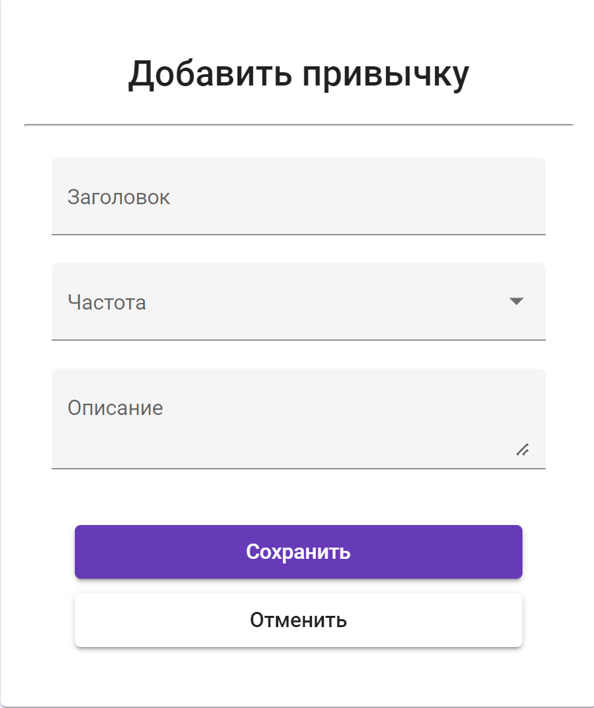

# СПИСОК ПРИВЫЧЕК
---

Проект включает в себя список привычек собранных в одном месте по типу TODO листа. Проект реализован на Angular.

Макеты страниц выполнены в редакторе Figma.
- Ссылка: <>

---

**Страница со списоком**

**Страница добавления элемента**

**Страница редактирования элемента**

---

**Функции используемые в проекте:**

- Функция отображения всего списка
- Функция добавления нового элемента в список
- Функция редактирования элемента в списке
- Функция удаления элемента из списка

---

**Модели данных:**

- Модель элемента списка
  - Загловок элемента
  - Частота выполнения
  - Описание элемента
  
- Модель пользователя:
  - Логин
  - Пароль
  - Список привычек

---

**Техническая информация**
В папке проекта из командной строки запустить `npm ci` для актуального наполнения `node_modules`. Если node.js версии 17+, 
дополнительно выполнить `set NODE_OPTIONS=--openssl-legacy-provider`. Далее запуск проекта `ng serve`. Теперь проект доступен по `http://localhost:4200/`.
